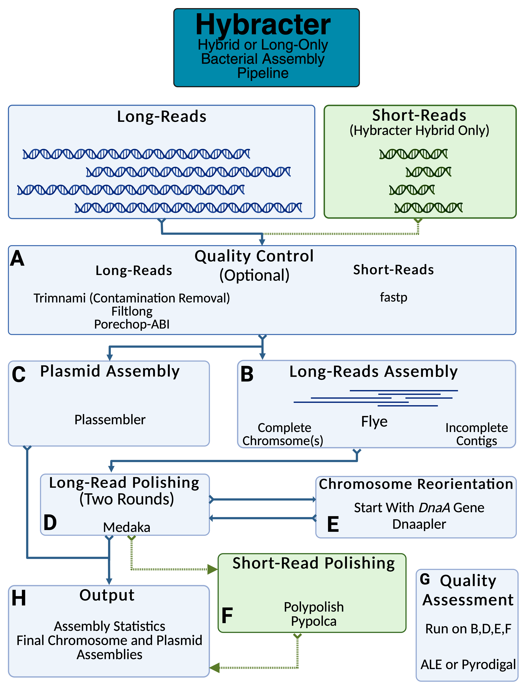

[](https://colab.research.google.com/github/gbouras13/hybracter/blob/main/run_hybracter.ipynb)

[](https://doi.org/10.1099/mgen.0.001244)

[](https://opensource.org/licenses/MIT)
[](https://github.com/beardymcjohnface/Snaketool)

[](https://zenodo.org/badge/latestdoi/574521745)

[](https://anaconda.org/bioconda/hybracter)
[](https://img.shields.io/conda/dn/bioconda/hybracter)
[](https://badge.fury.io/py/hybracter)
[](https://pepy.tech/project/hybracter)

# Hybracter: Enabling Scalable, Automated, Complete and Accurate Bacterial Genome Assemblies

`hybracter` is an automated long-read first bacterial genome assembly tool implemented in Snakemake using [Snaketool](https://github.com/beardymcjohnface/Snaketool). 

## Table of Contents

- [Hybracter: Enabling Scalable, Automated, Complete and Accurate Bacterial Genome Assemblies](#hybracter-enabling-scalable-automated-complete-and-accurate-bacterial-genome-assemblies)
  - [Table of Contents](#table-of-contents)
  - [Quick Start](#quick-start)
    - [Conda](#conda)
    - [Container](#container)
    - [Google Colab Notebooks](#google-colab-notebooks)
  - [Documentation](#documentation)
  - [Manuscript](#manuscript)
  - [Description](#description)
  - [Pipeline](#pipeline)
  - [Benchmarking](#benchmarking)
  - [Recent Updates](#recent-updates)
    - [v0.9.0 Updates (18 September 2024)](#v090-updates-18-september-2024)
  - [Why Would You Run Hybracter?](#why-would-you-run-hybracter)
  - [Other Options](#other-options)
      - [Trycycler](#trycycler)
      - [Dragonflye](#dragonflye)
  - [Installation](#installation)
    - [Conda](#conda-1)
    - [Pip](#pip)
    - [Source](#source)
  - [Main Commands](#main-commands)
  - [Input csv](#input-csv)
      - [`hybracter hybrid`](#hybracter-hybrid)
      - [`hybracter long`](#hybracter-long)
  - [Usage](#usage)
      - [`hybracter install`](#hybracter-install)
      - [Installing Dependencies](#installing-dependencies)
      - [`hybracter hybrid`](#hybracter-hybrid-1)
      - [`hybracter hybrid-single`](#hybracter-hybrid-single)
      - [`hybracter long`](#hybracter-long-1)
      - [`hybracter long-single`](#hybracter-long-single)
  - [Outputs](#outputs)
    - [Main Output Files](#main-output-files)
  - [Snakemake Profiles](#snakemake-profiles)
  - [Advanced Configuration](#advanced-configuration)
  - [Older Updates](#older-updates)
    - [v0.7.0 Updates (04 March 2024)](#v070-updates-04-march-2024)
    - [v0.5.0 Updates (08 January 2024)](#v050-updates-08-january-2024)
    - [v0.4.0 Updates (14 November 2023)](#v040-updates-14-november-2023)
    - [v0.2.0 Updates 26 October 2023 - Medaka, Polishing and `--no_medaka`](#v020-updates-26-october-2023---medaka-polishing-and---no_medaka)
  - [Version Log](#version-log)
  - [System](#system)
  - [Bugs and Suggestions](#bugs-and-suggestions)
- [Citation](#citation)


## Quick Start

### Conda

`hybracter` is available to install with `pip` or `conda`.

You will need conda or mamba available so `hybracter` can install all the required dependencies. 

Therefore, it is recommended to install `hybracter` into a conda environment as follows.

```bash
conda create -n hybracterENV -c bioconda -c conda-forge  hybracter
conda activate hybracterENV
hybracter --help
hybracter install
```

Miniforge is **highly highly** recommended. Please see the [documentation](https://hybracter.readthedocs.io/en/latest/install/) for more details on how to install Miniforge.

When you run `hybracter` for the first time, all the required dependencies will be installed as required, so it will take longer than usual (usually a few minutes). Every time you run it afterwards, it will be a lot faster as the dependenices will be installed.

If you intend to run hybracter offline (e.g. on HPC nodes with no access to the internet), I highly recommend running `hybracter test-hybrid` and/or `hybracter test-long` on a node with internet access so hybracter can download the required dependencies. It should take 5-10 minutes. If your computer/node has internet access, please skip this step.

```
hybracter test-hybrid --threads 8
hybracter test-long --threads 8
```

### Container

Alternatively, a Docker/Singularity Linux container image is available for Hybracter (starting from v0.7.1) [here](https://quay.io/repository/gbouras13/hybracter). This will likely be useful for running Hybracter in HPC environments.

* **Note** the container image comes with the database and all environments installed - there is no need to run `hybracter install` or `hybracter test-hybrid`/`hybracter test-long` or to specify a database directory with `-d`.

To install and run v0.8.0 with singularity

```bash

IMAGE_DIR="<the directory you want the .sif file to be in >"
singularity pull --dir $IMAGE_DIR docker://quay.io/gbouras13/hybracter:0.8.0

containerImage="$IMAGE_DIR/hybracter_0.8.0.sif"

# example command with test fastqs
 singularity exec $containerImage    hybracter hybrid-single -l test_data/Fastqs/test_long_reads.fastq.gz \
 -1 test_data/Fastqs/test_short_reads_R1.fastq.gz  -2 test_data/Fastqs/test_short_reads_R2.fastq.gz \
 -o output_test_singularity -t 4 --auto
```

### Google Colab Notebooks

If you don't want to install `hybracter` locally, you can run it without any code using the colab notebook [https://colab.research.google.com/github/gbouras13/hybracter/blob/main/run_hybracter.ipynb](https://colab.research.google.com/github/gbouras13/hybracter/blob/main/run_hybracter.ipynb)

This is only recommend if you have one or a few samples to assemble (it takes a while per sample due to the limited nature of Google Colab resources - probably an hour or two a sample). If you have more than this, a local install as described below is suggested.

## Documentation

Documentation for `hybracter` is available [here](https://hybracter.readthedocs.io/en/latest/).

## Manuscript 

`hybracter` has recently been published in _Microbial Genomics_

* George Bouras, Ghais Houtak, Ryan R Wick, Vijini Mallawaarachchi, Michael J. Roach, Bhavya Papudeshi, Louise M Judd, Anna E Sheppard, Robert A Edwards, Sarah Vreugde - Hybracter: Enabling Scalable, Automated, Complete and Accurate Bacterial Genome Assemblies. (2024) _Microbial Genomics_ doi: https://doi.org/10.1099/mgen.0.001244.

## Description

`hybracter` is designed for assembling bacterial isolate genomes using a long read first assembly approach. 
It scales massively using the embarassingly parallel power of HPC and Snakemake profiles. It is designed for applications where you have isolates with Oxford Nanopore Technologies (ONT) long reads and optionally matched paired-end short reads for polishing.

`hybracter` is desined to straddle the fine line between being as fully feature-rich as possible with as much information as you need to decide upon the best assembly, while also being a one-line automated program. In other words, as awesome as Unicycler, but updated for 2023. Perfect for lazy people like myself.

`hybracter` is largely based off Ryan Wick's [magnificent tutorial](https://github.com/rrwick/Perfect-bacterial-genome-tutorial) and associated [paper](https://doi.org/10.1371/journal.pcbi.1010905). `hybracter` differs in that it adds some additional steps regarding targeted plasmid assembly with [plassembler](https://github.com/gbouras13/plassembler), contig reorientation with [dnaapler](https://github.com/gbouras13/dnaapler) and extra polishing and statistical summaries.

Note: if you have Pacbio reads, as of 2023, you can run  `hybracter long` with `--no_medaka` to turn off polishing, and  `--flyeModel pacbio-hifi`. You can also probably just run [Flye](https://github.com/fenderglass/Flye) or [Dragonflye](https://github.com/rpetit3/dragonflye) (or of course [Trycyler](https://github.com/rrwick/Trycycler) ) and reorient the contigs with [dnaapler](https://github.com/gbouras13/dnaapler) without polishing. See Ryan Wick's [blogpost](https://doi.org/10.5281/zenodo.7703461) for more details. 

## Pipeline

<p align="center">
  
</p>

- A. Reads are quality controlled with [Filtlong](https://github.com/rrwick/Filtlong), [Porechop](https://github.com/rrwick/Porechop), [fastp](https://github.com/OpenGene/fastp) and optionally contaminant removal using modules from [trimnami](https://github.com/beardymcjohnface/Trimnami).
- B. Long-read assembly is conducted with [Flye](https://github.com/fenderglass/Flye). Each sample is classified if the chromosome(s) were assembled (marked as 'complete') or not (marked as 'incomplete') based on the given minimum chromosome length.
- C. For complete isolates, plasmid recovery with [Plassembler](https://github.com/gbouras13/plassembler).
- D. For all isolates, long read polishing with [Medaka](https://github.com/nanoporetech/medaka).
- E. For complete isolates, the chromosome is reorientated to begin with the dnaA gene with [dnaapler](https://github.com/gbouras13/dnaapler).
- F. For all isolates, if short reads are provided, short read polishing with [Polypolish](https://github.com/rrwick/Polypolish) and [pypolca](https://github.com/gbouras13/pypolca).
- G. For all isolates, assessment of all assemblies with [ALE](https://github.com/sc932/ALE) for `hybracter hybrid` or [Pyrodigal](https://github.com/althonos/pyrodigal) for `hybracter long`.
- H. The best assembly is selected and and output along with final assembly statistics.

## Benchmarking

`hybracter` was benchmarked in both hybrid and long modes (specifically using the `hybrid-single` and `long-single` commands) against [Unicycler](https://github.com/rrwick/Unicycler) v0.5.0 and [Dragonflye](https://github.com/rpetit3/dragonflye) v1.1.2.

30 samples from 5 studies with available reference genomes were benchmarked. You can see the full explanation and results [here](https://hybracter.readthedocs.io/en/latest/benchmarking/). You can find all the output [here](https://doi.org/10.5281/zenodo.10906937).

To summarise the conclusions:

* `Hybracter hybrid` was superior to Unicycler in terms of accuracy, time taken and (slighly) in terms of plasmid recovery. It should be preferred to Unicycler.
* You should use `hybracter long` if you care about plasmids and have only long reads. It performs similarly to hybrid methods and its inclusion of [Plassembler](https://github.com/gbouras13/plassembler) largely seems to solve the [problem of long read assemblers recovering small plasmids](https://doi.org/10.1099/mgen.0.001024).
* `Hybracter` in both modes is inferior to Dragonflye in terms of time though better in terms of chromosome accuracy. 
* If you want the fastest possible chromosome assemblies for applications like species ID or sequence typing that retain a high level of accuracy, Dragonflye is a good option.
* Dragonflye should not be used if you care about recovering plasmids.

## Recent Updates

### v0.9.0 Updates (18 September 2024)

**`--auto` for automatic estimation of chromosome size**

* Thanks to an [issue](https://github.com/gbouras13/hybracter/issues/90) and code from @[richardstoeckl](https://github.com/richardstoeckl), Hybracter can now estimate the estimated chromosome size for each sample by passing `--auto`. 
* The implementation uses [kmc](https://github.com/refresh-bio/KMC). Specifically, Hybracter uses kmc to count the number of unique 21mers that appear at least 10 times in your long-read FASTQ file. This is because, for a given assembly of length L,  and a k-mer size of k, the total number of unique possible k-mers  will be given by ( L – k ) + 1, and if L >> k, then it suffices as an estimate of total assembly size
* The estimated chromosome size used by Hybracter will actually be 80% of the number of 21-mers found at least 10 times, as it needs to account for plasmids
* If you aren't sure whether you have enough data for assembly (i.e. coverage lower than 20x), be careful using `--auto`, because the actual assembly size will tend to be larger than the number of unique 21mers found at least 10 times. Therefore, the estimated chromosome size will almost certainly be an underestimate and may lead to Hybracter considering your assembly "complete" when in fact it isn't.

* If you use `--auto`, you do not need to specify the chromosome length in the input. This means you don't need to `-c` with `long-single` or `hybrid-single` and in the input csv sample sheet, you do not need a column with chromosome length.
  
e.g. for `hybracter long` you only need 2 columns with sample name and long-read FASTQ file path:

```bash
s_aureus_sample1,sample1_long_read.fastq.gz
p_aeruginosa_sample2,sample2_long_read.fastq.gz
```

and for `hybracter hybrid` you only need 4 columns with sample name, long-read FASTQ, and R1 and R2 short-read FASTQ file paths:

```bash
s_aureus_sample1,sample1_long_read.fastq.gz,sample1_SR_R1.fastq.gz,sample1_SR_R2.fastq.gz
p_aeruginosa_sample2,sample2_long_read.fastq.gz,sample2_SR_R1.fastq.gz,sample2_SR_R2.fastq.gz
```

**Other changes**

* Hybracter v0.9.0 will automatically support the reorientation of archaeal chromosomes (thanks @[richardstoeckl](https://github.com/richardstoeckl)) to begin with the cog1474 Orc1/cdc6 gene.
* `--datadir` can now also accept 2 paths separated by a comma, if you have long reads and short reads in separate directories e.g. `--datadir "long_read_dir,short_read_dir"` (https://github.com/gbouras13/hybracter/issues/76).
* `--min_depth` parameter added. Hybracter will error out if your QC'd long reads have a coverage lower than `min_depth` for a sample (https://github.com/gbouras13/hybracter/issues/89).

## Why Would You Run Hybracter?

* If you want the best possible _automated_ long read only or hybrid bacterial isolate genome assembly.
* In other words, if you love Unicycler like I do, but want something faster and more accurate.
* If you need to assemble many (e.g. 10+) bacterial isolates as efficiently as possible.
* If you want all information about from assembly pipeline such as whether your polishing probably improved the genome, whether your assembly was likely complete, and how many plasmids you probably assembled.

## Other Options

#### Trycycler

If you are looking for the best possible (manual) bacterial assembly for a single isolate, please definitely use [Trycyler](https://github.com/rrwick/Trycycler). 

  * `hybracter` will almost certainly not give you better assemblies than Trycycler. Trycycler is the gold standard for a reason.
  * `hybracter` is automated, scalable, faster and requires less bioinformatics/microbial genomics expertise to run. 
  * If you use Trycycler, I would also highly recommend using (disclaimer: my own program) [plassembler](https://github.com/gbouras13/plassembler) (which is built into hybracter) along side Trycycler to assemble small plasmids if you are especially interested in those, because long read only assemblies often [miss small plasmids](https://doi.org/10.1099/mgen.0.001024).

#### Dragonflye

[Dragonflye](https://github.com/rpetit3/dragonflye) by the awesome @[rpetit3](https://github.com/rpetit3) is a good alternative for automated assembly if `hybracter` doesn't fit your needs, particuarly if you are familiar with [Shovill](https://github.com/tseemann/shovill). Some pros and cons between `hybracter` and `dragonflye` are listed below.

  * `dragonflye` allows for more options with regards to assemblers (it supports [Miniasm](https://github.com/lh3/miniasm) or [Raven](https://github.com/lbcb-sci/raven) as well as Flye).
  * On a single isolate, `dragonflye` should be faster.
  * `hybracter` should be more accurate, due to the extra round of polishing following reorientation, and integration of Plassembler.
  * `hybracter` has the advantage of scalability across multiple samples due to its Snakemake and Snaketool implementation. 
  * So if you have access to a cluster, `hybracter` is for you and likely faster.
  * `hybracter` gives more accurate plasmid assemblies because it uses [plassembler](https://github.com/gbouras13/plassembler)
  * `hybracter` will suggest automatically whether an assembly is 'complete' or 'incomplete'
  * `hybracter` will assess each polishing step and choose the genome most likely to be the best quality.

## Installation

You will need conda  (**highly recommended** through miniforge) to run `hybracter`, because it is required for the installation of each compartmentalised environment (e.g. Flye will have its own environment). Please see the [documentation](https://hybracter.readthedocs.io/en/latest/install/) for more details on how to install miniforge.

### Conda

`hybracter` is available to install with `conda`. To install `hybracter` into a conda enviornment called `hybracterENV`:

```bash
conda create -n hybracterENV hybracter
conda activate hybracterENV
hybracter --help
hybracter install
```

### Pip

`hybracter` is available to install with `pip` . 

You will also need conda available so `hybracter` can install all the required dependencies. Therefore, it is recommended to install `hybracter` into a conda environment as follows.


```bash
conda create -n hybracterENV pip
conda activate hybracterENV
pip install hybracter
hybracter --help
hybracter install
```

### Source

Alternatively, the development version of `hybracter` (which may include new, untested features) can be installed manually via github. 

```bash
git clone https://github.com/gbouras13/hybracter.git
cd hybracter
pip install -e .
hybracter --help
```

## Main Commands

* `hybracter hybrid`: Assemble multiple genomes from isolates that have long-reads and paired-end short reads.
* `hybracter hybrid-single`: Assembles a single genome from an isolate with long-reads and paired-end short reads. It takes similar parameters to [Unicycler](https://github.com/rrwick/Unicycler).
* `hybracter long`: Assemble multiple genomes from isolates that have long-reads only.
* `hybracter long-single`: Assembles a single genome from an isolate with long-reads only.
* `hybracter install`: Downloads and installs the required `plassembler` database.

```bash
 _           _                    _            
| |__  _   _| |__  _ __ __ _  ___| |_ ___ _ __ 
| '_ \| | | | '_ \| '__/ _` |/ __| __/ _ \ '__|
| | | | |_| | |_) | | | (_| | (__| ||  __/ |   
|_| |_|\__, |_.__/|_|  \__,_|\___|\__\___|_|   
       |___/


Usage: hybracter [OPTIONS] COMMAND [ARGS]...

  For more options, run: hybracter command --help

Options:
  -h, --help  Show this message and exit.

Commands:
  install        Downloads and installs the plassembler database
  hybrid         Run hybracter with hybrid long and paired end short reads
  hybrid-single  Run hybracter hybrid on 1 isolate
  long           Run hybracter with only long reads
  long-single    Run hybracter long on 1 isolate
  test-hybrid    Test hybracter hybrid
  test-long      Test hybracter long
  config         Copy the system default config file
  citation       Print the citation(s) for hybracter
  version        Print the version for hybracter
```

## Input csv

`hybracter hybrid` and `hybracter long` require an input csv file to be specified with `--input`. No other inputs are required.

* This file requires no headers.
* Other than the reads, `hybracter` requires a value for a lower bound the minimum chromosome length for each isolate in base pairs. It must be an integer.
* `hybracter` will denote contigs about this value as chromosome(s) and if it can recover a chromosome, it will denote the isolate as complete.
* In practice, I suggest choosing 90% of the estimated chromosome size for this value.
* e.g. for _S. aureus_, I'd choose 2500000, _E. coli_, 4000000, _P. aeruginosa_ 5500000.

#### `hybracter hybrid`

* `hybracter hybrid` requires an input csv file with 5 columns. 
* Each row is a sample.
* Column 1 is the sample name you want for this isolate. 
* Column 2 is the long read fastq file.
* Column 3 is the minimum chromosome length for that sample.
* Column 4 is the R1 short read fastq file
* Column 5 is the R2 short read fastq file.

e.g.

```bash
s_aureus_sample1,sample1_long_read.fastq.gz,2500000,sample1_SR_R1.fastq.gz,sample1_SR_R2.fastq.gz
p_aeruginosa_sample2,sample2_long_read.fastq.gz,5500000,sample2_SR_R1.fastq.gz,sample2_SR_R2.fastq.gz
```

**Using `--auto`**

* If you use `--auto`, you can remove the column with the chromosome length

e.g.

```bash
s_aureus_sample1,sample1_long_read.fastq.gz,sample1_SR_R1.fastq.gz,sample1_SR_R2.fastq.gz
p_aeruginosa_sample2,sample2_long_read.fastq.gz,sample2_SR_R1.fastq.gz,sample2_SR_R2.fastq.gz
```

#### `hybracter long`

`hybracter long` also requires an input csv with no headers, but only 3 columns.

* `hybracter long` requires an input csv file with 3 columns. 
* Each row is a sample.
* Column 1 is the sample name you want for this isolate. 
* Column 2 is the long read fastq file.
* Column 3 is the minimum chromosome length for that sample.

e.g.

```bash
s_aureus_sample1,sample1_long_read.fastq.gz,2500000
p_aeruginosa_sample2,sample2_long_read.fastq.gz,5500000
```

**Using `--auto`**

* If you use `--auto`, you can remove the column with the chromosome length

```bash
s_aureus_sample1,sample1_long_read.fastq.gz
p_aeruginosa_sample2,sample2_long_read.fastq.gz
```

## Usage

#### `hybracter install`

You will first need to install the `hybracter` databases.

```bash
hybracter install
```

Alternatively, can also specify a particular directory to store them - you will need to specify this with `-d <databases directory>` when you run `hybracter`.

```bash
hybracter install -d  <databases directory>
```

#### Installing Dependencies

**If you have internet access on the machine or node where you are running hybracter, you can skip this step.**

When you run `hybracter` for the first time, all the required dependencies will be installed as required, so it will take longer than usual (usually a few minutes). Every time you run it afterwards, it will be a lot faster as the dependenices will be installed.

If you intend to run hybracter offline (e.g. on HPC nodes with no access to the internet), I highly recommend running `hybracter  test-hybrid ` and/or `hybracter test-long` on a node with internet access so hybracter can download the required dependencies. It should take 5-10 minutes.

```bash
hybracter test-hybrid 
hybracter test-long
hybracter --help
```

Once that is done, run `hybracter hybrid` or `hybracter long` as follows.

#### `hybracter hybrid`

```bash
hybracter hybrid -i <input.csv> -o <output_dir> -t <threads> 
```

* `hybracter hybrid` requires only a CSV file specified with `-i` or `--input`
* `--no_pypolca` will turn off pypolca polishing.
* Use `--min_length` to specify the minimum long-read length for Filtlong.
* Use `--min_quality` to specify the minimum long-read quality for Filtlong.
* You can specify a FASTA file containing contaminants with `--contaminants`. All long reads that map to contaminants will be filtered out.
  * You can specify Escherichia phage lambda (a common contaminant in Nanopore library preparation) using `--contaminants lambda`.
* `--skip_qc` will skip all read QC steps.
* You can change the `--medakaModel` (all available options are listed in `hybracter hybrid -h`)
* You can change the `--flyeModel` (all available options are listed in `hybracter hybrid -h`)
* You can turn off Medaka polishing using `--no_medaka`
* You can turn off pypolca polishing using `--no_pypolca`
* You can force `hybracter` to pick the last polishing round (not the best according to ALE) with `--logic last`. `hybracter` defaults to picking the best (according to ALE) i.e. `--logic best`.

#### `hybracter hybrid-single`

```bash
hybracter hybrid-single -l <longread FASTQ> -1 <R1 short reads FASTQ> -2 <R2 short reads FASTQ> -s <sample name> -c <chromosome size> -o <output_dir> -t <threads>  [other arguments]
```

#### `hybracter long`

```bash
hybracter long -i <input.csv> -o <output_dir> -t <threads> [other arguments]
```

* `hybracter long` requires only a CSV file specified with `-i` or `--input`
* Use `--min_length` to specify the minimum long-read length for Filtlong.
* Use `--min_quality` to specify the minimum long-read quality for Filtlong.
* You can specify a FASTA file containing contaminants with `--contaminants`. All long reads that map to contaminants will be filtered.
  * You can specify Escherichia phage lambda (a common contaminant in Nanopore library preparation) using `--contaminants lambda`.
* `--skip_qc` will skip all read QC steps.
* You can change the `--medakaModel` (all available options are listed in `hybracter long -h`)
* You can change the `--flyeModel` (all available options are listed in `hybracter long -h`)
* You can turn off Medaka polishing using `--no_medaka`
* You can force `hybracter` to pick the last polishing round (not the best according to pyrodigal mean CDS length) with `--logic last`. `hybracter` defaults to picking the best i.e. `--logic best`.


#### `hybracter long-single`

```bash
hybracter long-single -l <longread FASTQ> -s <sample name> -c <chromosome size>  -o <output_dir> -t <threads>  [other arguments]
```

## Outputs 

`hybracter` creates a number of output files in different formats. 

For more information about all possible file outputs, please see the documentation here.

### Main Output Files

The main outputs are in the `FINAL_OUTPUT` directory.

This directory will include:

1. `hybracter_summary.tsv` file. This gives the summary statistics for your assemblies with the following columns:


|Sample |Complete (True or False) | Total_assembly_length |	Number_of_contigs |	Most_accurate_polishing_round |	Longest_contig_length |	Longest_contig_coverage |Number_circular_plasmids |
|--------|-----------------------|-------------------------|-------------------|--------|--|--|--|


2. `complete` and `incomplete` directories.

All samples that are denoted by hybracter to be complete will have 5 outputs in the `complete` directory:

   * `sample`_summary.tsv containing the summary statistics for that sample.
   * `sample`_per_contig_stats.tsv containing the contig names, lengths, GC% and whether the contig is circular.
   * `sample`_final.fasta containing the final assembly for that sample.
   * `sample`_chromosome.fasta containing only the final chromosome(s) assembly for that sample.
   * `sample`_plasmid.fasta containing only the final plasmid(s) assembly for that sample. Note this may be empty. If this is empty, then that sample had no plasmids. 

All samples that are denoted by hybracter to be incomplete will have 3 outputs in the `incomplete` directory:

   * `sample`_summary.tsv containing the summary statistics for that sample.
   * `sample`_per_contig_stats.tsv containing the contig names, lengths, GC% and whether the contig is circular.
   * `sample`_final.fasta containing the final assembly for that sample.


## Snakemake Profiles

I would highly highly recommend running hybracter using a Snakemake profile. Please see this blog [post](https://fame.flinders.edu.au/blog/2021/08/02/snakemake-profiles-updated) for more details. I have included an example slurm profile in the profile directory, but check out this [link](https://github.com/Snakemake-Profiles) for more detail on other HPC job scheduler profiles.

```bash
hybracter hybrid --input <input.csv> --output <output_dir> --threads <threads> --profile profiles/hybracter
```

## Advanced Configuration

Thanks to its Snakemake backend, you can modify resource requirements for each job contained within `hybracter` using the configuration file. A defauly can be created using the `hybracter config` command. This can make it even more efficient in server environment, as many jobs can be more efficiently parallelised than the default settings. For more information, please see the [documentation](https://hybracter.readthedocs.io/en/latest/configuration/) 

## Older Updates 

### v0.7.0 Updates (04 March 2024)

**Changes to short read polishing**

* Logic added to run `polypolish` v0.6.0 with `--careful` and skip pypolca if the SR coverage estimate is below 5x (note: FASTA files for pypolca will be generated in the processing directory to play nice with Snakemake, but these will be identical to the polypolish output). 
* For 5-25x coverage, `polypolish --careful` and `pypolca` with `--careful` will be run. 
* For >25x coverage, `polypolish` default and `pypolca` with `--careful` will be run. 
* A preprint justifying these changes will be available soon.

**`--logic` changes**

* By default, `--logic` defaults to `last` for `hybracter hybrid`, as there we have found that the polishing strategy implemented above never makes the assembly worse. We suggest never using `--logic best` with `hybracter hybrid`.

**Changes for chromosome contigs and circularity**

* If hybracter assembles a contig that is greater than the minimum chromosome length but not marked as circular by Flye, this will now be denoted as a chromosome, but not circular. The genome will be marked as complete also. 
    * These will usually be assemblies with some issue (e.g. prophages, circularisation issues, heterogeneity) and probably require some more attention.
    * For example, with the _Vibrio cholerae_ larger chromosome described [here](https://rrwick.github.io/2024/02/15/misassemblies.html), the genome will be marked as 'complete' but the contig will not be marked as 'circular' in the `hybracter` output.
    * Such contigs will be polished and be in the final `_chromosome.fasta` output, but they will not be rotated by `dnaapler`. 
    * These were previously being excluded, which was missing assemblies with structural heterogeneity (causing the chromosome not to completely circularise) or even bacteria with linear chromosomes like [_Borrelia_](https://www.nature.com/articles/37551). 

**Adds `--depth_filter`** 

* This is passed to [Plassembler](https://github.com/gbouras13/plassembler) and will filter out all putative plasmid contigs that are lower than this depth fraction compared to the chromosome.
* Defaults to 0.25 like Unicycler's implementation.

### v0.5.0 Updates (08 January 2024)

Ryan Wick recently ran `hybracter long` on the latest Dorado v0.5.0 basecalled Nanopore reads (his [blog post](https://rrwick.github.io/2023/12/18/ont-only-accuracy-update.html)). You can read a write-up of the results [here](https://hybracter.readthedocs.io/en/latest/dorado_ryan_louise_0_5_0/). As a result, subsampling has been added to Hybracter. 

* Adds subsampling using `--subsample_depth` using Filtlong, based on some benchmarking of Dorado v0.5.0. Defaults to 100x of the estimated chromosome size `-c`.
* Also adds stricter criteria for complete assemblies (aka ensures that identified chromosomes must be circularised according to Flye).
  
### v0.4.0 Updates (14 November 2023)

* Adds `--logic` parameter. You have 2 choices: `--logic best` (the default) or `--logic last`.
* `--logic best` will run `hybracter` as normal and the best assembly (by ALE or pyrodigal mean length) will be selected as the final assembly.
* `--logic last` will force hybracter to pick the last polished round as the final assembly even if it is not the best as per ALE/pyrodigal. So for `hybracter hybrid` this will default to the pypolca polished round, for hybracter long it will be Medaka round 2. You may wish to use this if you want all your isolates to be consistently assembled.
* Adds reorientation of pre polished chromosome in case it is selected as the best assembly
* Adds fixes to the chromosome comparisons - now it is much easier to interpret any changes between polishing rounds.


### v0.2.0 Updates 26 October 2023 - Medaka, Polishing and `--no_medaka`

Ryan Wick's [blogpost](https://rrwick.github.io/2023/10/24/ont-only-accuracy-update.html) on 24 October 2023 suggests that if you have new 5Hz SUP or Res (bacterial model specific) ONT reads, Medaka polishing often makes things worse! It also implies that Nanopore reads are almost good enough to assemble perfect bacterial genomes (at least with Trycycler) which is pretty awesome.

Combined with the difficulty and randomness in installing Medaka from Nanopore, I have therefore decided to add a `--no_medaka` flag into v0.2.0. 

I have also set Medaka to be v1.8.0 and I do not intend to upgrade this going forward, as this is the most recent stable bioconda version that doesn't seem to cause too much grief. 

If you have trouble with Medaka installation, I'd therefore suggest please using `--no_medaka`.

`hybracter` should still handle cases where Medaka makes assemblies worse. If Medaka makes your assembly appreciably worse, `hybracter` should choose the best most accurate assembly as the unpolished one in long mode. 


## Version Log

A brief description of what is new in each update of `hybracter` can be found in the HISTORY.md file.

## System

`hybracter` is tested on Linux and on MacOS.

## Bugs and Suggestions

If you come across bugs with `hybracter`, or would like to make any suggestions to improve the program, please open an issue or email george.bouras@adelaide.edu.au.

# Citation

If you use Hybracter, please cite the manuscript along with core dependencies (they are also our tools!):

Hybracter Manuscript
* George Bouras, Ghais Houtak, Ryan R Wick, Vijini Mallawaarachchi, Michael J. Roach, Bhavya Papudeshi, Louise M Judd, Anna E Sheppard, Robert A Edwards, Sarah Vreugde - Hybracter: Enabling Scalable, Automated, Complete and Accurate Bacterial Genome Assemblies. (2024) _Microbial Genomics_ doi: https://doi.org/10.1099/mgen.0.001244.

Plassembler:
* Bouras G., Sheppard A.E., Mallawaarachchi V., Vreugde S., Plassembler: an automated bacterial plasmid assembly tool, Bioinformatics, Volume 39, Issue 7, July 2023, btad409, https://doi.org/10.1093/bioinformatics/btad409. 

Dnaapler:
* George Bouras, Susanna R. Grigson, Bhavya Papudeshi, Vijini Mallawaarachchi, Michael J. Roach (2024). Dnaapler: A tool to reorient circular microbial genomes. Journal of Open Source Software, 9(93), 5968, https://doi.org/10.21105/joss.05968.

Ryan Wick et al's Assembling the perfect bacterial genome paper, which provided the intellectual framework for hybracter:
* Wick RR, Judd LM, Holt KE (2023) Assembling the perfect bacterial genome using Oxford Nanopore and Illumina sequencing. PLoS Comput Biol 19(3): e1010905. https://doi.org/10.1371/journal.pcbi.1010905

I would also recommend citing Hybracter's other dependencies if you can where they are used:

Flye:
* Kolmogorov, M., Yuan, J., Lin, Y. et al. Assembly of long, error-prone reads using repeat graphs. Nat Biotechnol 37, 540–546 (2019). https://doi.org/10.1038/s41587-019-0072-8

Snaketool:
* Roach MJ, Pierce-Ward NT, Suchecki R, Mallawaarachchi V, Papudeshi B, Handley SA, et al. (2022) Ten simple rules and a template for creating workflows-as-applications. PLoS Comput Biol 18(12): e1010705. https://doi.org/10.1371/journal.pcbi.1010705

Trimnami:
* Roach MJ. (2023) Trimnami. https://github.com/beardymcjohnface/Trimnami.

Filtlong:
* Wick RR (2018) Filtlong. https://github.com/rrwick/Filtlong.

Porechop and Porechop_abi:
* Quentin Bonenfant, Laurent Noé, Hélène Touzet, Porechop_ABI: discovering unknown adapters in Oxford Nanopore Technology sequencing reads for downstream trimming, Bioinformatics Advances, Volume 3, Issue 1, 2023, vbac085, https://doi.org/10.1093/bioadv/vbac085
* Wick RR (2017) https://github.com/rrwick/Porechop.

fastp:
* Shifu Chen, Yanqing Zhou, Yaru Chen, Jia Gu, fastp: an ultra-fast all-in-one FASTQ preprocessor, Bioinformatics, Volume 34, Issue 17, September 2018, Pages i884–i890, https://doi.org/10.1093/bioinformatics/bty560. 

ALE:
* Scott C. Clark, Rob Egan, Peter I. Frazier, Zhong Wang, ALE: a generic assembly likelihood evaluation framework for assessing the accuracy of genome and metagenome assemblies, Bioinformatics, Volume 29, Issue 4, February 2013, Pages 435–443, https://doi.org/10.1093/bioinformatics/bts723

Medaka:
* Oxford Nanopore Technologies, Medaka. https://github.com/nanoporetech/medaka.

Pyrodigal:
* Larralde, M., (2022). Pyrodigal: Python bindings and interface to Prodigal, an efficient method for gene prediction in prokaryotes. Journal of Open Source Software, 7(72), 4296, https://doi.org/10.21105/joss.04296.

Polypolish:
* Wick RR, Holt KE (2022) Polypolish: Short-read polishing of long-read bacterial genome assemblies. PLoS Comput Biol 18(1): e1009802. https://doi.org/10.1371/journal.pcbi.1009802.

Pypolca:
* Bouras G, Judd LM, Edwards RA, Vreugde S, Stinear TP, Wick RR (2024) How low can you go? Short-read polishing of Oxford Nanopore bacterial genome assemblies. bioRxiv 2024.03.07.584013; doi: [https://doi.org/10.1101/2024.03.07.584013](https://doi.org/10.1101/2024.03.07.584013).
* Zimin AV, Salzberg SL (2020) The genome polishing tool POLCA makes fast and accurate corrections in genome assemblies. PLoS Comput Biol 16(6): e1007981. https://doi.org/10.1371/journal.pcbi.1007981. 

Snakemake:
* Mölder F, Jablonski KP, Letcher B et al. Sustainable data analysis with Snakemake [version 1; peer review: 1 approved, 1 approved with reservations]. F1000Research 2021, 10:33 (https://doi.org/10.12688/f1000research.29032.1).

KMC:
* Marek Kokot, Maciej Długosz, Sebastian Deorowicz, KMC 3: counting and manipulating k-mer statistics, Bioinformatics, Volume 33, Issue 17, 01 September 2017, Pages 2759–2761, (https://doi.org/10.1093/bioinformatics/btx304).